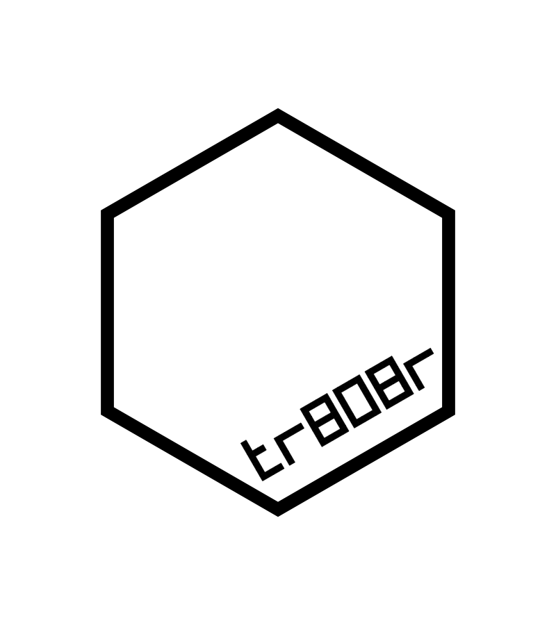
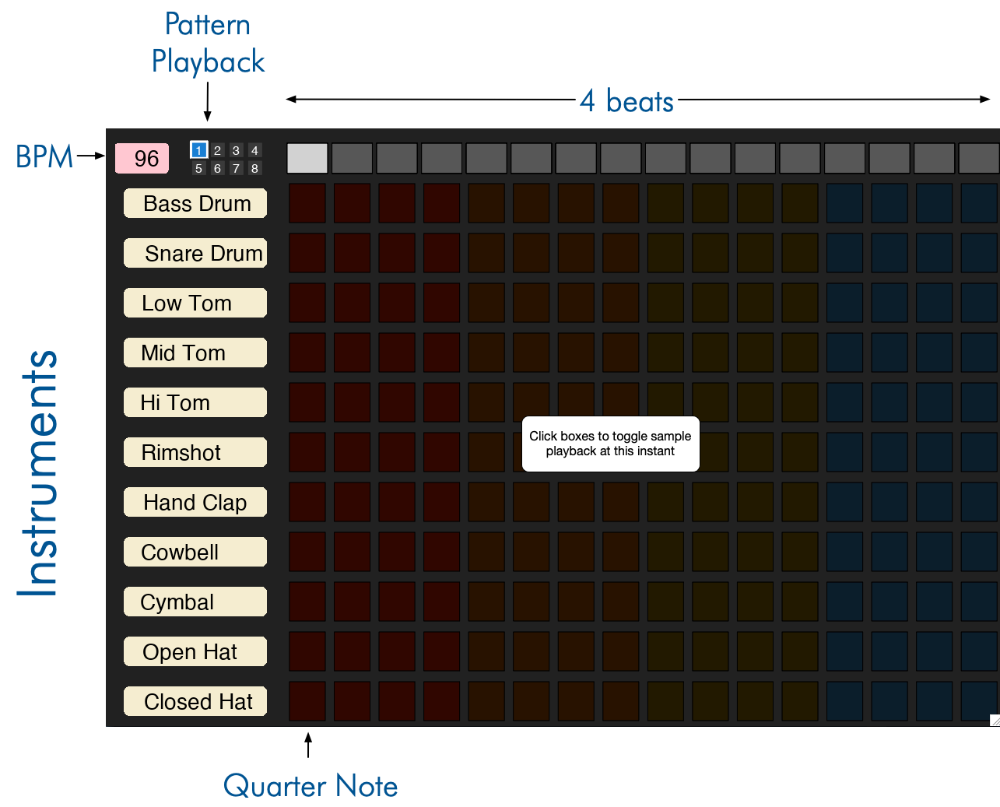

<!-- README.md is generated from README.Rmd. Please edit that file -->

# tr808r (pronounced ‘traitor’) 

<!-- badges: start -->


<!-- badges: end -->

`{tr808r}` is a tiny sound-a-like for [Roland’s TR-808 drum
machine](https://en.wikipedia.org/wiki/Roland_TR-808).

This is a great tech demo for how
[`eventloop}`](https://github.com/coolbutuseless/eventloop) allows you
to write complex interactive applications using just R.

## What’s in the box

-   `tr808()` Start an interactive TR-808 session.

## Limitations/Future possibilities

-   No current support for pre-scale selection or accents.
-   No support for any level/tone decay tuning of any instrument.
-   Base instruments only. No congas, claves or maracas.

## Installation

Note that `{tr808r}` relies on the `{eventloop}` package for handling
the interactivity on macOS and unix-like platforms.

Windows OS is not supported by `{eventloop}` as R on Windows does not
(currently) support the `onIdle` callback.

You can install from [GitHub](https://github.com/coolbutuseless/tr808r)
with:

``` r
# install.package('remotes')
remotes::install_github('coolbutuseless/eventloop')  #  >= v0.1.1
remotes::install_github('coolbutuseless/tr808r')
```

## Compose your own

-   Press SPACE to play/pause
-   CLick boxes to toggle playback of that instrument at that time
-   There are 8 editable patterns.
-   Use keys ‘1’ to ‘8’ to toggle pattern playback. This will let you
    compose longer rhythms by chaining together the playback.
-   Use SHIFT ‘1’ - ‘8’ to immediately jump to a particular pattern
-   UP and DOWN arrows will change tempo
-   ‘s’ will save the machine state in the current directory in a
    time-stamped file.
    -   this can be related with `tr808(state = ...)`
-   ‘t’ will output a text representatin of the current pattern which
    you can tweet!
-   You can play back a tweeted pattern by copying the text from twitter
    and passing it in to `tr808(state = ...)`

``` r
tr808()
```

#### <a href="https://coolbutuseless.github.io/package/tr808r/images/compose.mp4">Watch video with sound</a>



## Play back an existing song pattern

Open the drum machine with an existing song.

``` r
tr808(state = demo_songs[[1]])
```

#### <a href="https://coolbutuseless.github.io/package/tr808r/images/demo1.mp4">Watch video with sound</a>

## Tweeting patterns and playing back tweeted patterns

This is a easy, fun(?) way to share patterns on twitter!

#### Create your own tweetable

Press `t` (for twitter) within the application to print a text
represetntation to your R console.

If you have [`{clipr}`](https://cran.r-project.org/package=clipr)
installed then the text will also be copied to your clipboard for easy
pasting into twitter!

    #RStats #tr808r
    BD xx____xx__x_____
    SD ____x_______x___
    LT ________________
    MT xx______________
    HT ______xx__x__x__
    RS ________________
    CP xx_xx_xx_______x
    CB xx__x_xx_x_x_xx_
    CY ________________
    OH ________________
    CH x_xxx_xxx_xxx_xx

#### Playback a tweet

If you’d like to play a pattern that someone has tweeted, copy the text
and pass it to `tr808()` as the initial `state`

``` r
tr808(state = '
#RStats #tr808r
BD xx____xx__x_____
SD ____x_______x___
LT ________________
MT xx______________
HT ______xx__x__x__
RS ________________
CP xx_xx_xx_______x
CB xx__x_xx_x_x_xx_
CY ________________
OH ________________
CH x_xxx_xxx_xxx_xx')
```

## Related Software

-   [Roland’s online version of the TR-808](https://roland50.studio/)
-   [Another web TR-808](https://io808.com/)
-   [Some classic drum patterns for the
    TR-808](http://808.pixll.de/index.php%20patterns)
-   [TB-303 Bass
    synthesizer](https://en.wikipedia.org/wiki/Roland_TB-303)

## Acknowledgements

-   R Core for developing and maintaining the language.
-   CRAN maintainers, for patiently shepherding packages onto CRAN and
    maintaining the repository
